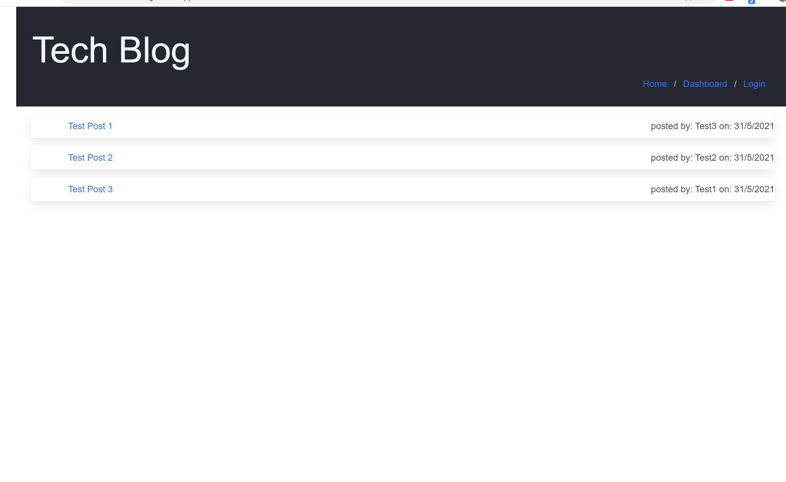

# Tech Blog

## Table of contents
* Description
* User Story
* Installation
* Demo
* Contribution
* Questions

## Description

Writing about tech can be just as important as making it. Developers spend plenty of time creating new applications and debugging existing codebases, but most developers also spend at least some of their time reading and writing about technical concepts, recent advancements, and new technologies. A simple Google search for any concept covered in this course returns thousands of think pieces and tutorials from developers of all skill levels!

My task this week is to build a CMS-style blog site similar to a Wordpress site, where developers can publish their blog posts and comment on other developers’ posts as well. My app will follow the MVC paradigm in its architectural structure, using Handlebars.js as the templating language, Sequelize as the ORM, and the express-session npm package for authentication.

## User Story

```md
AS A developer who writes about tech
I WANT a CMS-style blog site
SO THAT I can publish articles, blog posts, and my thoughts and opinions
```
## Installation

Steps to follow:
* Run 'npm install' to install modules
* Run 'npm run seed' to seed the database with data
* Run 'npm run start' to start the application

## Demo

The following image demonstrate the appearance of the deployed app.



Here is a link to the depolyed application: <https://ross-white-tech-blog.herokuapp.com/>

## Contributions
Ross White

## Questions
For any questions regarding this project, I can be contacted through:
* GitHub- <github.com/ross-white>
* Email- <rosswhite@outlook.com>